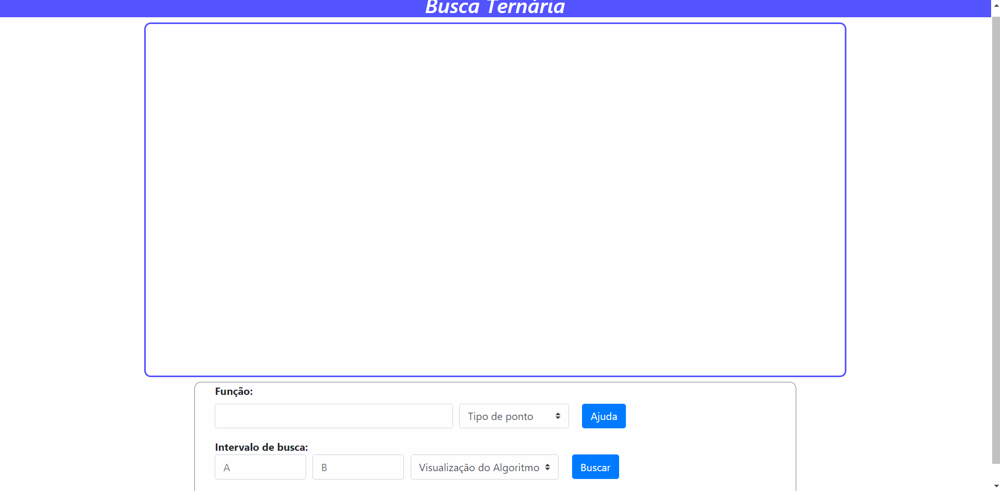

# Máximos e Mínimos

**Número da Lista**: Lista 04 
**Conteúdo da Disciplina**: Dividir para Conquistar 

## Alunos
|Matrícula | Aluno |
| -- | -- |
| 15/0059329  |  Francisco Wallacy Coutinho Braz |
| 17/0144259  |  Gustavo Nogueira Rodrigues |

## Sobre 
O objetivo do projeto é encontrar máximos e mínimos de [funções unimodais](https://en.wikipedia.org/wiki/Unimodality) utilizando a busca ternária, bem como exibir o funciomento do algoritmo em um gráfico.

## Screenshots

## Instalação 
**Linguagem**: JavaScript 
O projeto pode ser executado a partir dos navegadores google chrome ou mozilla firefox. Passos para execução:
1) Clone do projeto: git clone git@github.com:projeto-de-algoritmos/DC_Maximos-E-Minimos.git
2) Abrir o arquivo index.html pelo navegador.

## Uso 
1) Inicialmente o usuário de informar a função que deseja encontrar um ponto extremo. Para funções, como seno e potência, a entrada deve seguir a sintaxe para chamada de funções do Javascript. Para expressões,como 2*x + 5, deve seguir a sintaxe utilizada para os operações aritméticos do Javascript. **A variável independente sempre deve ser x**;
2) Informar que tipo de ponto que deseja encontrar;
3) Informar um intervalo em que a função seja unimodal;
4) Informar como deseja visualizar o funcionamento do algoritmo;
5) Clicar em buscar.
* Para mais detalhes basta verificar o gif de demonstração ou clicar no botão de ajuda.

## Outros 
**Referências:**

[Slide TEP](https://github.com/edsomjr/TEP/blob/master/Introducao/slides/BO-1/BO-1.pdf)

[GeeksforGeeks](https://www.geeksforgeeks.org/ternary-search/)

